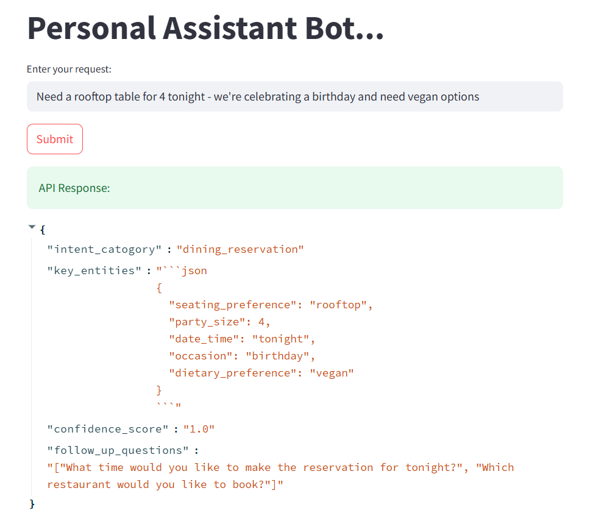
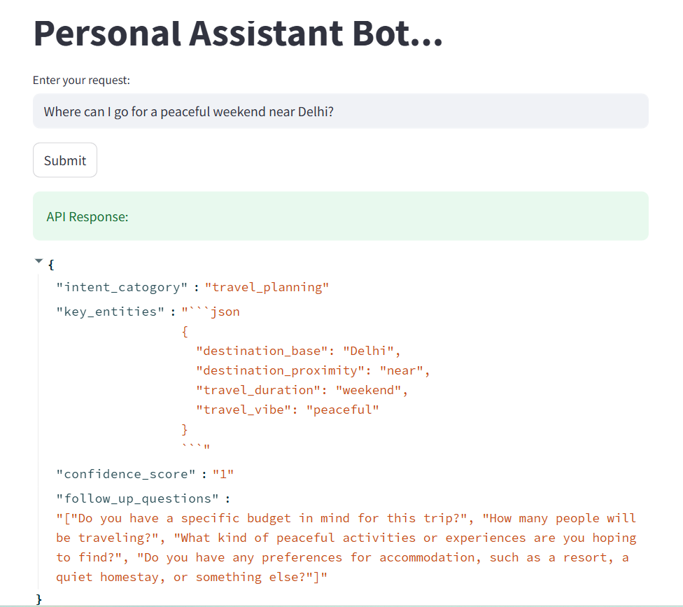
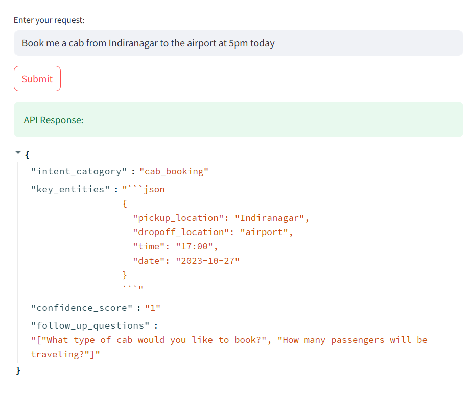
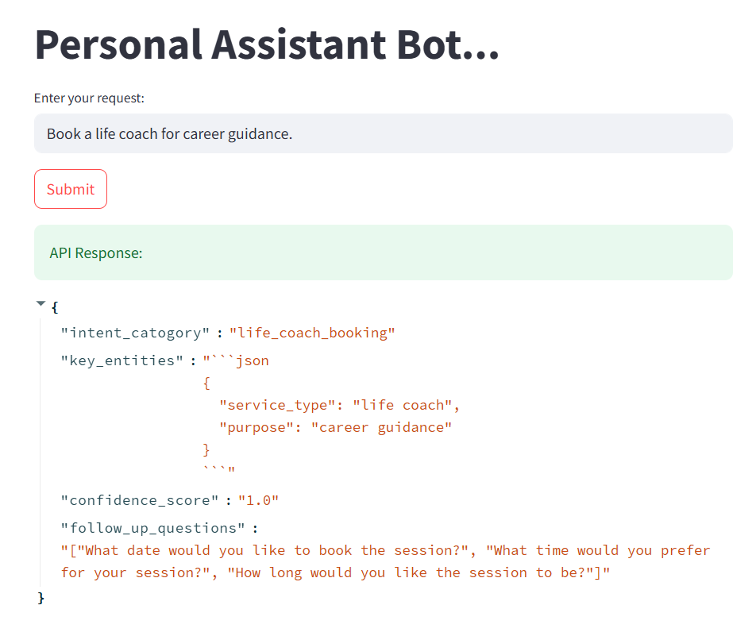

# Personal Assistant Bot - Interactive Demo

<h2>📅 Dining Requests (Click to Expand/Collapse)</h2>

{ width=600 }
{ width=600 }
{ width=600 }

<h2>✈️ Travel Planning</h2>

{ width=600 }
{ width=600 }
{ width=600 }

<h2>🛎 Special Services</h2>

{ width=400 }
{ width=400 }
{ width=400 }

