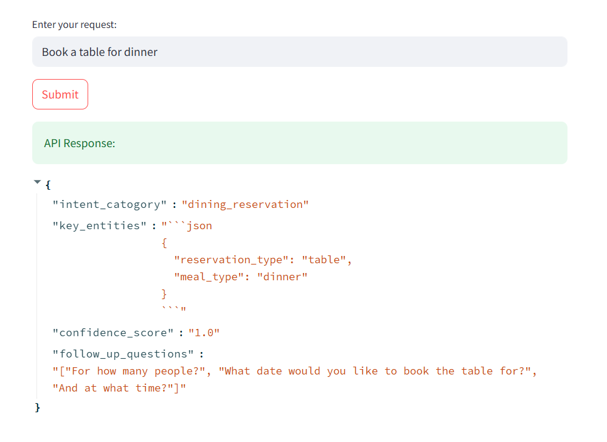
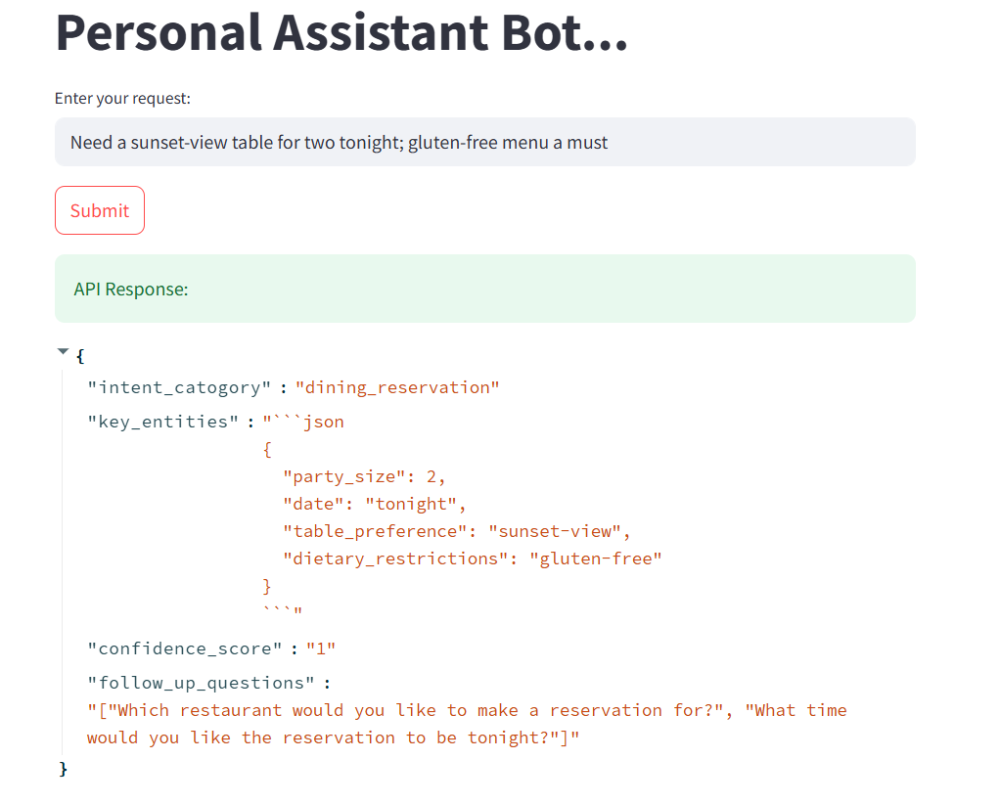
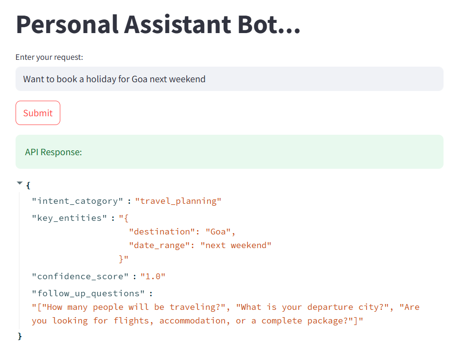
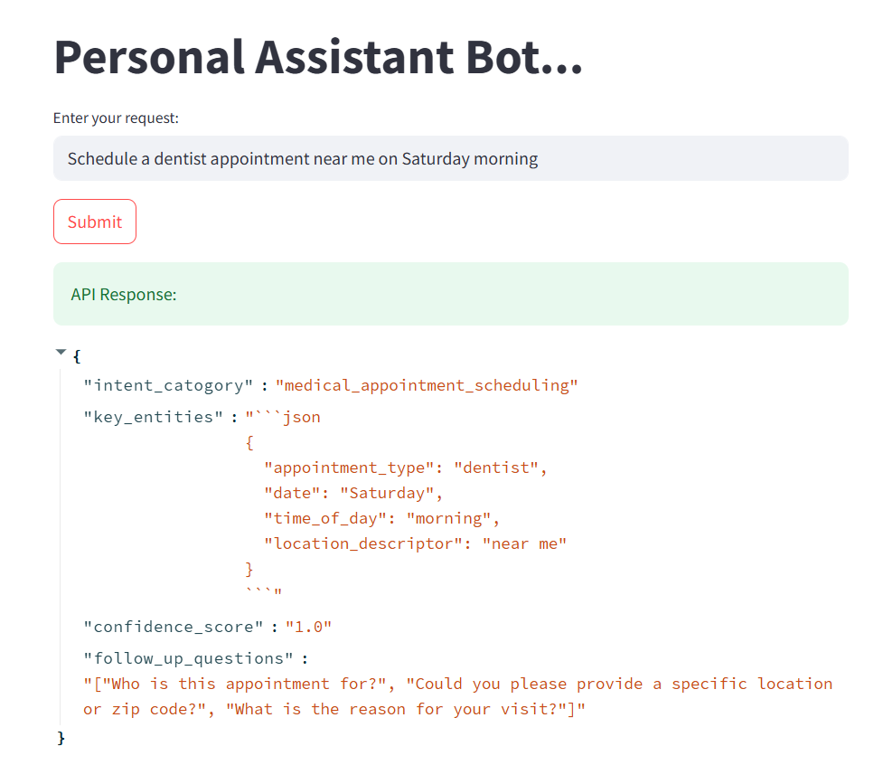

# Personal Assistant Bot - Sample Interactions

## Dining Requests

---

## Travel Planning

---

## Specialized Services

  

    
    
<em>Transportation</em>

  

  

    
    
<em>Healthcare</em>

  

  

    
    
<em>Professional Services</em>

  

---

## Gift Recommendations

## How to Use These Samples

1. Click any image to view full resolution
2. Observe the bot's handling of different request types
3. Notice consistent UI across various service categories
